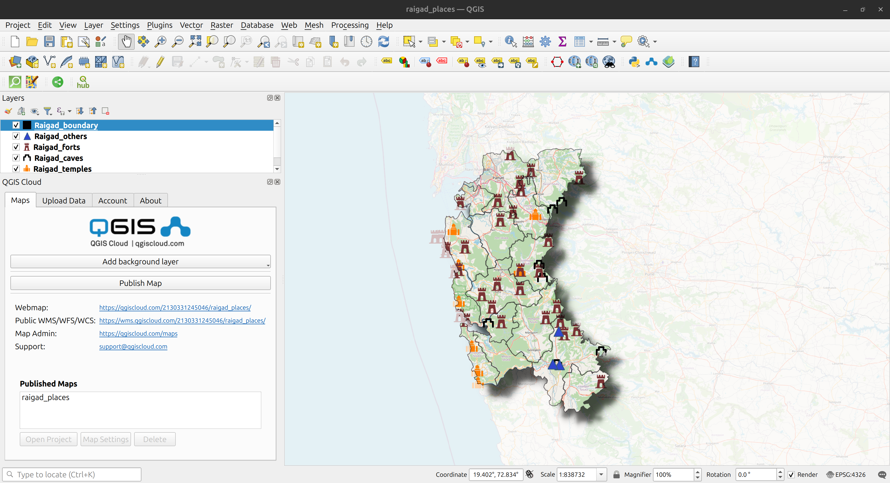
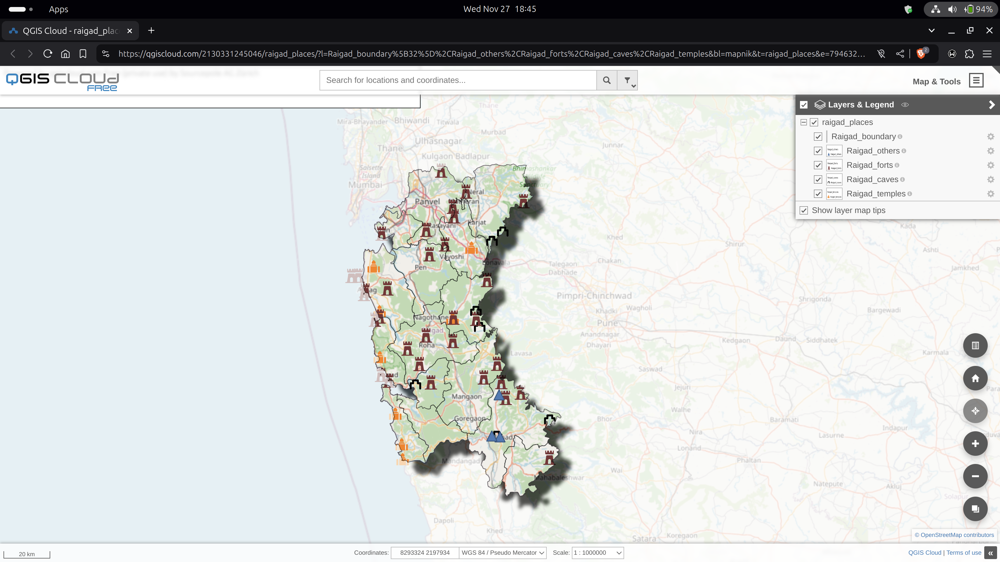
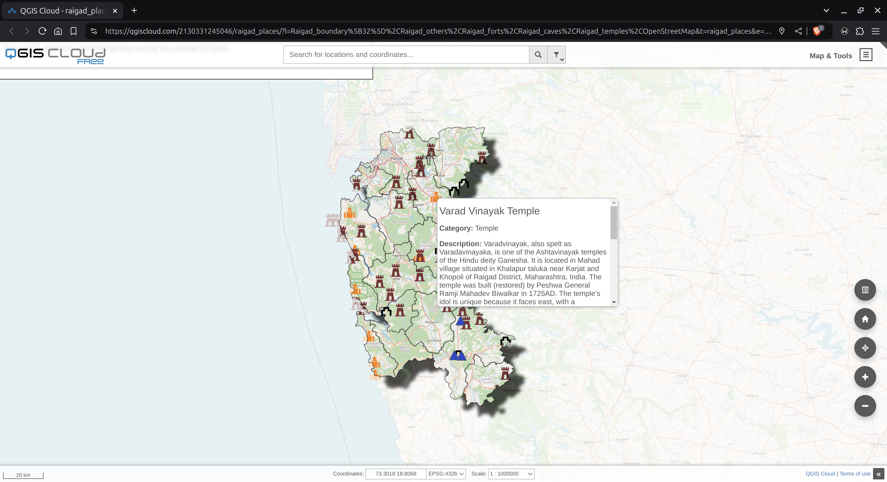
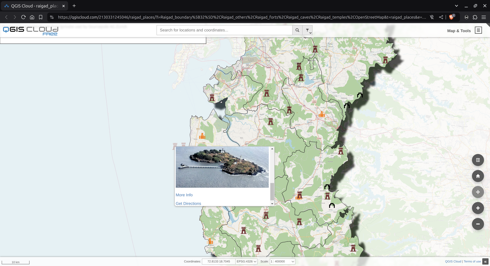

# Mapping Cultural Places in Raigad using QGIS
This repository contains a QGIS project that maps and visualizes the cultural and historical landmarks of Raigad District, Maharashtra. It includes interactive features like hover-based details, categorized filtering, and navigation links, making it a useful tool for researchers, tourists, and heritage enthusiasts to explore the region’s rich history and culture.

## Project Objectives
- Map and categorize cultural places in Raigad (e.g., forts, temples, landmarks).
- Enable interactive functionalities like hover details and navigation links.
- Provide an accessible tool for exploring cultural heritage.

## Features
### Interactive Map:
- Hover over places to view details like name, category, description, and links.
- Embedded direction links for easy navigation.
### Categorization:
- Places classified by type (e.g., forts, temples).
- Filtering options for better visualization.
### Layer Styling:
- Custom symbols for different categories.
- District boundary highlighted.

## Data Attributes
The project uses the following data fields:
- Place Name: Name of the cultural place.
- Category: Type of place (e.g., fort, temple).
- Latitude & Longitude: Geographic coordinates.
- Description: Brief information about the place.
- Image URL: Link to an image of the place.
- Link to Page: Link to detailed information.
- Direction Link: Google Maps link for navigation.

## Technologies Used
- QGIS: For mapping and visualization.
- QGIS Cloud: For deploying map.
- Excel: For organizing and cleaning data.
- Google Maps: For generating direction links.
- Web Technologies: React, Leaflet, xlsx, CSS.

## Challenges and Solutions
- Challenge: Aligning data with exact coordinates.
- Solution: Verified coordinates using multiple online sources.
- Challenge: Styling multiple layers effectively.
- Solution: Utilized QGIS symbology and plugins.
## Results
- Successfully mapped 51 cultural places in Raigad.
- Interactive features implemented for enhanced usability.
- Developed a visually appealing and informative map for cultural exploration.

## Screenshots
### QGIS Software

### QGIS Cloud Deployment

### Interactive Map

## How to Use
- Clone the repository:
git clone https://github.com/your-username/qgis-mapping-raigad.git
- Open the QGIS project file in QGIS.
- Explore the map by hovering over places and using the filtering options.

## License
This project is licensed under the MIT License.

